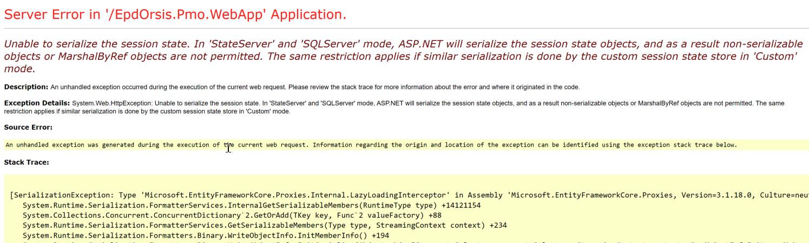

# Unable to serialize the session state. In 'StateServer' and 'SQLServer' mode



Error Message: `Unable to serialize the session state. In 'StateServer' and 'SQLServer' mode, ASP.NET will serialize the session state objects, and as a result non-serializable objects or MarshalByRef objects are not permitted. The same restriction applies if similar serialization is done by the custom session state store in 'Custom' mode.`

```
[SerializationException: Type 'Microsoft.EntityFrameworkCore.Proxies.Internal.LazyLoadingInterceptor' in Assembly 'Microsoft.EntityFrameworkCore.Proxies, Version=3.1.18.0, Culture=neutral, PublicKeyToken=adb9793829ddae60' is not marked as serializable.]
```

最近個project將Entity Framework 6 migrate到Entity Framework core 3 (原因: EF6 就淘汰+反人類), local development一直用緊In Process做session state, 事事順利. 一上UAT即刻GG, 因為UAT用緊localhost state server的tcpip作為session state, 當用戶login時就會爆runtime error...

因為我係成個User object儲係session, 而呢個object入面又連帶住其他table的object(s), 而EF Core噶lazy loading真系好l方便(EF6 成日用Eager loading, ok的, but not the best). 所以當 `Session["CurrentUser"] = currentUser;` 就會發生runtime error.

因為lazy loading原因, user連帶噶object即係E.g. `public virtual Address HomeAddress `
並沒加載, 而入tcpip session要將object轉成JSON, 所以當C# object to JSON噶時候呢個HomeAddress就會serialize fail (成日寫Api的你有機會遇到過). Google左下, 都有人遇到差唔多噶情況,
[efcore/issues/14558](https://github.com/dotnet/efcore/issues/14558) 但都係解決不能. 睇番[doc (Lazy loading without proxies)](https://learn.microsoft.com/en-us/ef/core/querying/related-data/lazy), 係可行但係我有十幾二十個table(model)要做呢個動作, 就算寫個abstract class再dynamic做呢個動作都好大workload & 難maintance. 而且唔想改太多code噶情況下可以做噶方案有:

1. 用In process mode
2. 將user 自帶噶基本資料作為base class, inherit base user 後再implement其他連帶噶model(s)
3. 用Lazy loading without proxies

For 1. 參考[[IIS][ASP.net] 連線逾時，Session Timeout的設定](https://dotblogs.com.tw/shadow/2017/09/14/195114) 但係壞處係當同一時間user太多, 效能有機會chur爆, 當application domain自動回收時session will be lost.
For 2. There are the samples, 進入session前避開virtual object, 只將user基本資料儲入session(同理儲Id都得不夠無感方便), 但之後如果要操作virtual obejct要將做model mapping

```csharp
//original code
namespace Project.Models
{
    [Serializable]
    public class User
    {
        public int Id {get; set;}
        public string Name { get; set; }

        public virtual Address HomeAddress {get; set;}
    }

    public class Address 
    {
        public string Street { get; set; }
        public string City { get; set; }
        public string State { get; set; }
        public string ZipCode { get; set; }
    }
}
```

Object Usage:

```csharp
public ActionResult Login(User user)
{
    Session["PmoUser"] = user; //runtime error
}
```

Modified Version:

```csharp
//Modified code
namespace Project.Models
{
    [Serializable]
    public class User
    {
        public int Id {get; set;}
        public string Name { get; set; }
    }

    public class NormalUser: User 
    {
        public virtual Address HomeAddress {get; set;}
    }

    public class Address 
    {
        public string Street { get; set; }
        public string City { get; set; }
        public string State { get; set; }
        public string ZipCode { get; set; }
    }
}
```

Obejct Usage:

```csharp
public ActionResult Login(NormalUser user)
{
    Session["PmoUser"] = new User() { Id = user.Id, Name = user.Name };
}
```

For 3. 用Lazyloader.load 方法

```csharp
namespace Project.Models
{
    [Serializable]
    public class User
    {
        public User()
        {
        }

        private User(Action<object, string> lazyLoader)
        {
            LazyLoader = lazyLoader;
        }  
        private Action<object, string> LazyLoader { get; set; }

        public int Id { get; set; }
        public string Name { get; set; }

        private Address _homeAddress { get; set; }
        public Address HomeAddress 
        {
            get => LazyLoader.Load(this, ref _homeAddress);
            set => _homeAddress = value;
        }
    }

    public class Address 
    {
        public string Street { get; set; }
        public string City { get; set; }
        public string State { get; set; }
        public string ZipCode { get; set; }
    }
}

```

最後我選擇1, 改動最少, main少d野😎. Project用戶並發量唔算大, 所以暫時都無需要out of process (tcpip) 噶sesstion state. 如果真係要用我會推薦方法3.

Reference

[https://stackoverflow.com/questions/7276507/serializable-classes-and-dynamic-proxies-in-ef-how]()

[https://stackoverflow.com/questions/2714288/pros-and-cons-of-using-asp-net-session-state-server-instead-of-inproc]()

[https://github.com/dotnet/efcore/issues/14558]()

[https://learn.microsoft.com/en-us/ef/core/querying/related-data/lazy]()

[https://dotblogs.com.tw/shadow/2017/09/14/195114]()
